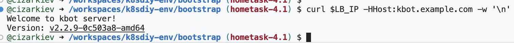

### Home Task 1

Disable option `--cloud-provider=external` for `kubelet`, `kube-apiserver` and `kube-controller-manager`.  
After that nginx container was able to start.

### Home task 2.1 (run control-plane as static pods)

- Added static pod manifests for etcd, kube-apiserver, kube-controller-manager, and kube-scheduler.

- Disabled manual startup of these components in setup.sh — they are now launched automatically by kubelet as static pods.

- Increased the maxPods parameter for kubelet from 4 to 40.

### Home task 2.2 (Kube-apiserver profiling)

- Create cluster
- run container with kubectl-flame (file kubectl-flame-pod.yaml)
- find kube-apiserver PID on codespace node (It doesn't work with `kubectl debug` way if kube-apiserver runs as a static pod)

  ```bash
  pgrep kube-apiserver

  ```
- run perf record generation:

  ```bash
  sudo kubebuilder/bin/kubectl exec kubectl-flame -- perf record -F 99 -g -p 9041 -o /tmp/out -- sleep 30
  ```
- create graph

  ```bash
  sudo kubebuilder/bin/kubectl exec kubectl-flame -- sh -c "/app/perf script -i /tmp/out | /app/FlameGraph/stackcollapse-perf.pl | /app/FlameGraph/flamegraph.pl > /tmp/flame.svg"
  ```
- copy graph file to localhost

  ```bash
  sudo kubebuilder/bin/kubectl cp kubectl-flame:/tmp/flame.svg /workspaces/mastering-k8s/kube-apiserver-flame.svg
  ```

### Home task 3.1 (Build and run Controller)

```bash
go mod tidy

controller-gen object paths="./api/..."

controller-gen crd:crdVersions=v1 paths=./... output:crd:artifacts:config=config/crd/bases

go build -o bin/manager main.go

kubectl apply -f config/crd/bases/apps.newresource.com_newresources.yaml

./bin/manager
```

### Home task 3.2 (Controller Testing and Metrics)

#### Running Tests

The controller includes unit tests using the `envtest` framework. To run the tests:

1. Install `setup-envtest` tool:
   ```bash
   go install sigs.k8s.io/controller-runtime/tools/setup-envtest@latest
   ```

2. Download Kubernetes test binaries (etcd, kube-apiserver):
   ```bash
   setup-envtest use
   ```

3. Set the KUBEBUILDER_ASSETS environment variable:
   ```bash
   export KUBEBUILDER_ASSETS="$(setup-envtest use -p path)"
   ```

4. Run the tests:
   ```bash
   cd new-controller
   go test -v ./test
   ```

The tests will:
- Start a local Kubernetes API server (using envtest)
- Apply the CRD
- Start the controller
- Create test resources
- Verify reconciliation works correctly

#### Accessing Controller Metrics

The controller exposes Prometheus metrics on port 8080 (by default).

While the controller is running, access metrics endpoint:
   ```bash
   curl http://localhost:8080/metrics
   ```

### Home task 4.1 (GitOps based on FluxCD with dynamic ImageUpdate)

1. Deploy initial infrastructure + FluxCD, repo: [k8sdiy-env](https://github.com/cizarkiev/k8sdiy-env)

2. Prepare application and build artifacts (container, helm chart), repo: [kbot-src](https://github.com/cizarkiev/kbot-src)

3. Prepare FluxCD repository, repo: [flux-gitops-dev](https://github.com/cizarkiev/flux-gitops-dev)

4. Test ImageUpdate when next release is created in [kbot-src](https://github.com/cizarkiev/kbot-src)

5. Test application work:

   

